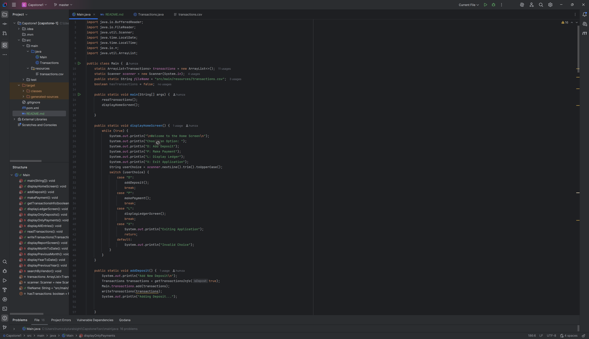

# Accounting Ledger Application

A Java Command Line Application for tracking financial transactions

## **Features**

- Add deposits and payments with automatic time/date stamping
- View all transactions, view deposits only, or view payments only
- Generate reports: Month to Date, Previous Month, Year to Date, Previous Year, Search by Vendor
- Stores entries in CSV file
- Transactions sorted by date (newest first)

## **Usage Guide**

### Home Screen:

- D - Add Deposit
- P - Make Payment
- L - Display Ledger
- X - Exit

### Ledger Screen:

- A - All Entries
- D - Deposits Only
- P - Payments Only
- R - Reports Screen
- H - Home

### Reports Screen:

- 1 - Month to Date
- 2 - Previous Month
- 3 - Year to Date
- 4 - Previous Year
- 5 - Search by Vendor

## Interesting Code
Transaction Sorting - Uses a comparator to display newest transactions first:

````bash
private static void displayAllEntries() {
        ArrayList<Transactions> sortedTransactions = new ArrayList<>(transactions);
        sortedTransactions.sort((t1, t2) -> {
            int dateCompare = t2.getDate().compareTo(t1.getDate());
            if (dateCompare != 0) {
                return dateCompare;
            }
            return t2.getTime().compareTo(t1.getTime());
        });
        for (Transactions t : sortedTransactions) {
            System.out.println(t);
        }
    }
````

## Application Screen Image:
